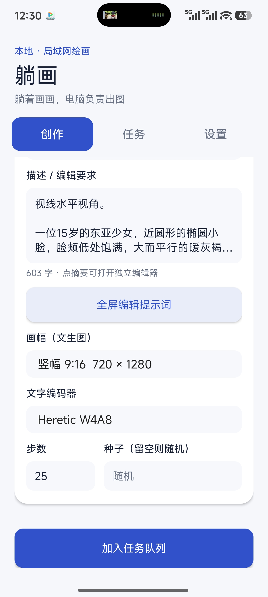
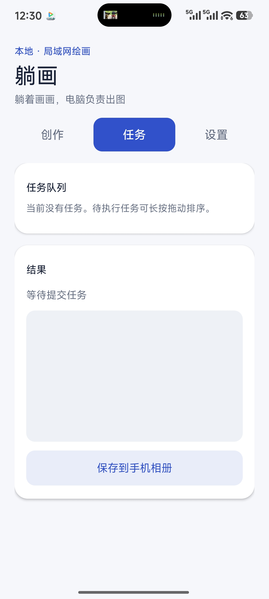
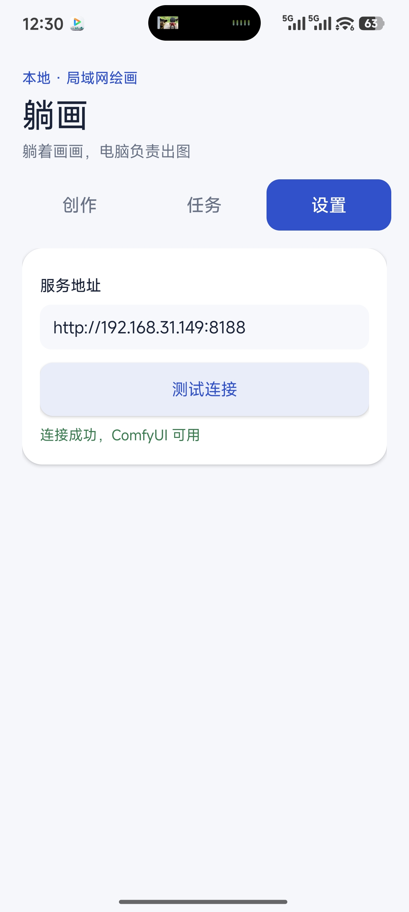

# 躺画 TangHua

[English](README.en.md) · [MIT License](LICENSE)

躺画是一个在局域网内使用 ComfyUI 绘图的 Android 客户端。手机负责编辑提示词、管理任务和查看结果；模型推理由自己的电脑完成。当前内置工作流面向 **Qwen Image 2.1**，使用 INT8 图像模型及 W4A8 文字编码器。

## 功能

- 文生图：提示词、画幅、步数、种子和标准／Heretic W4A8 编码器。
- 参考图编辑：一张必选主图，可添加第二张辅助参考图；选择后显示缩略图。主图决定编辑结果的基础画幅。
- 点击提示词摘要打开全屏编辑器：独立滚动、清空、字数提示、快速跳到开头／末尾；关闭后保存本机草稿。
- 串行任务队列：一次只提交一个任务；待执行任务支持长按拖动排序或移除，正在执行的任务可取消。
- 执行阶段、采样步数、估算百分比与剩余时间；生成结果可保存到手机相册。保存操作与绘图并行，连续点击不会重复保存。
- 任务历史：成功生成的图片和提示词、种子保存在手机本机；新任务不会覆盖旧结果，重启 App 后仍可打开历史图片并保存到相册。
- 新任务成功生成后发送系统通知；Android 13 及以上首次提交任务时会请求通知权限，点击通知可打开任务页。
- ComfyUI 服务地址由用户填写并保存在手机上。界面分为“创作”“任务”“设置”三个 Tab。

## 运行截图

<p align="center">
  
  
  
</p>

截图由实际运行的 Android App 提供，原图位于 `docs/screenshots/`。

## 使用条件

1. 一台可运行 ComfyUI 和 Qwen Image 2.1 工作流的电脑。默认模型文件名见 [`app/src/main/assets`](app/src/main/assets)。更换模型文件名时，需要同步修改工作流 JSON；文字编码器选项的文件名也在 `MainActivity.java` 中配置。
2. Android 10（API 29）或更新版本的手机，与电脑处于同一局域网。
3. 让 ComfyUI 监听局域网地址，例如 `python main.py --listen 0.0.0.0 --port 8188`。在手机“设置”页填写 `http://电脑局域网IP:8188` 并测试连接。

在“创作”页输入提示词，选择文生图或参考图编辑，点击“加入任务队列”。任务阶段、选中的结果和任务历史在“任务”页查看。图片也会保存在电脑的 ComfyUI `output` 目录；点击“保存到手机相册”会复制到手机 `Pictures/躺画`。任务历史保存在 App 私有存储中，卸载 App 会清除这些记录。

## 构建

用 Android Studio 打开本目录。工程使用 Android Gradle Plugin 8.4、Gradle 8.6、Java 17 和 Android SDK 34，无第三方运行依赖。也可以在已配置 `ANDROID_HOME`（或 `ANDROID_SDK_ROOT`）、Java 17 和 Android debug keystore 的 Windows 环境下执行：

```powershell
powershell -ExecutionPolicy Bypass -File .\build-offline.ps1
```

脚本生成 `TangHua-debug.apk`。使用同一签名时可覆盖安装旧版；为公开分发请自行配置正式签名。保留现有包名 `local.qwenimage.mobile` 是为了兼容旧版升级。

## 实现与限制

- 客户端调用 ComfyUI 的 `/upload/image`、`/prompt`、`/history/{prompt_id}`、`/view`、`/queue`、`/interrupt` 和 `/ws`。工作流模板在 `app/src/main/assets/`。
- 整体百分比按工作流阶段估算，采样步数来自实时事件；剩余时间在收到采样数据后按近期步速估算。
- 待执行队列仅保存在当前 App 进程中；系统结束 App 后，这些尚未提交的任务不会恢复。
- 当前使用局域网明文 HTTP，无账号鉴权。请只在可信局域网使用，不要把 ComfyUI 端口直接暴露到公网。

## 许可证

本项目采用 [MIT License](LICENSE)。Qwen Image 2.1、ComfyUI 和模型文件均有各自的许可条款；本仓库不包含模型权重。
